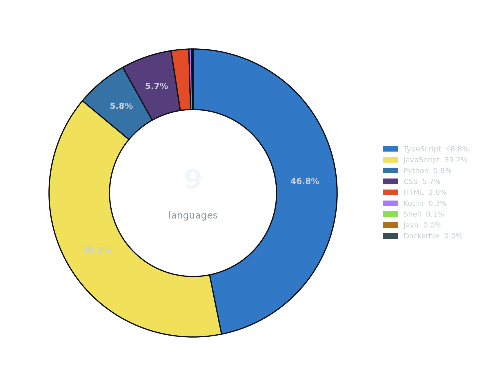
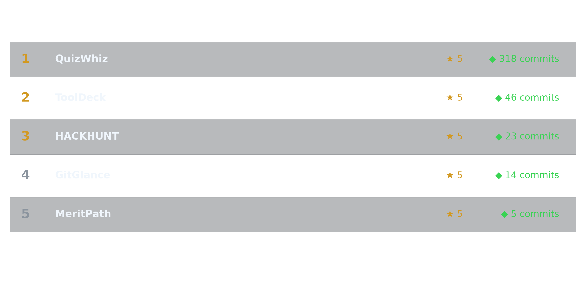
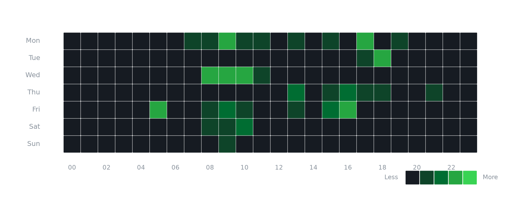

<table>
<tr>
<td width="20%" align="left" valign="middle">

<!-- Typing SVG — one word per line, larger font -->

</td>
<td width="80%" align="right" valign="middle">

</td>
</tr>
</table>

---

I'm a web developer and AI engineer who loves turning ideas into real products — student management systems, quiz platforms, AI-powered tools, and productivity apps. I focus on clean UI, practical features, and scalable architecture.

Currently exploring **AI-integrated web apps**, **no-code/low-code tools**, and **open-source**. My goal is to grow as a Full Stack Developer and AI Tools Developer, building solutions that are useful, user-friendly, and future-ready.

- 🔭 Building full-stack apps with **React + Node.js + MongoDB**
- 🌱 Learning **AI-integrated workflows** and **cloud-native tooling**
- 💬 Ask me about **React, Express, Flask, or anything web**
- ⚡ Fun fact: I ship more side-projects than I have hours in a day

---

<b>Languages</b>

 

<b>Frontend</b>

 

<b>Backend</b>

 

<b>Databases</b>

 

<b>Cloud & DevOps</b>

 

<b>Tools</b>

 

---

<table>
<tr>
<td width="40%" align="center" valign="middle">

</td>
<td width="60%" align="center" valign="middle">

</td>
</tr>
</table>

---

---

---

